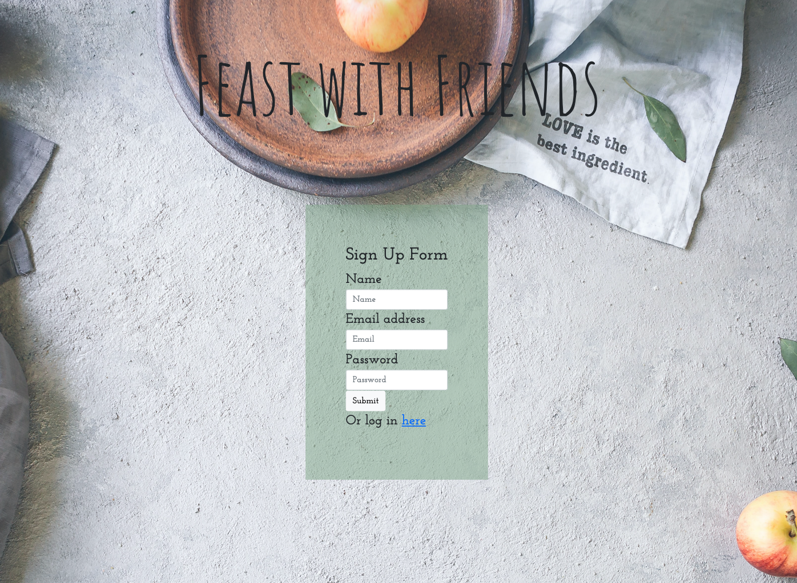
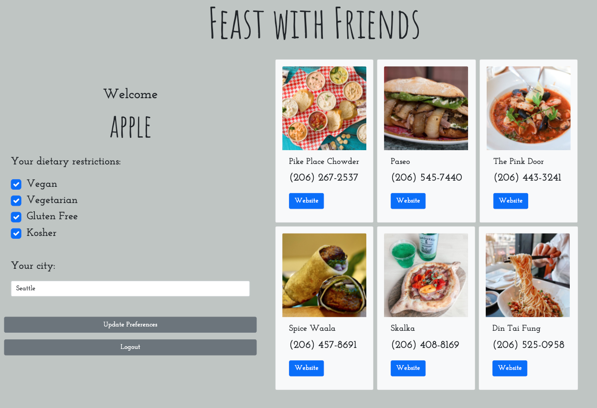

# Feast with Friends
## Table of Contents
* [Description](#description)
* [Project-Location](#project-location)
* [Dependencies](#dependencies)
* [Usage](#usage)
* [Future-Direction](#future-direction)
* [Credits](#credits)
* [Resources](#resources)
* [License](#license)

## Description
Feast with Friends is a mobile and web application that recommends a list of restaurants that matches the users' dietary restrictions & specified location. Upon securely logging into our application and completing your profile, restaurant suggestions appear along with helpful details such as the restaurant's phone number, website URL, and image. 

This application was created with the following User Story and Acceptance Criteria in mind:
```
AS A person with dietary restrictions
I WANT to receive restaurant recommendations, which take into account my dietary restrictions and my chosen city 
SO THAT I can feast with friends without worrying about having anaphylaxis
```
```
GIVEN that I want a customized restaurant recommendation
WHEN I create an account
THEN my account is saved in the database and I securely log into the profile page 
WHEN I am brought to my profile page
THEN I see my saved preferences and recommended restaurants based on my preferences
WHEN I see the list of recommended restaurants 
THEN I see the restaurants’ name, image, phone number, and website link 
WHEN I update my preferences 
THEN I see updated recommendations that reflect my latest preferences 
```

## Project-Location
* [Repository] (https://github.com/laurenb08/project2)
* [Deployed] (https://feastwithfriendsproject.herokuapp.com/)
  
## Dependencies
The dependencies are:
<br>

For the server and views:
* [express](http://expressjs.com/)
* [express-handlebars](https://www.npmjs.com/package/express-handlebars)
* [express-handlebars-sections](https://www.npmjs.com/package/express-handlebars-sections)
* [handlebars](https://handlebarsjs.com/)
<br>

For the customer database:
* [mysql](https://www.npmjs.com/package/mysql)
* [sequelize](https://www.npmjs.com/package/sequelize) 
<br>

For interaction with the Yelp API:
* [axios](https://www.npmjs.com/package/axios) 
<br>

For the authorization and login ability:
* [passport](https://www.npmjs.com/package/passport)
* [passport-local](https://www.npmjs.com/package/passport-local)
* [bcryptjs](https://www.npmjs.com/package/bcryptjs)
* [express-session](https://www.npmjs.com/package/express-session)

There is a `package.json` included, the following commands should be run to install dependencies:

```bash
npm i
```

## Usage
Use the links below to use the application live. If you prefer to run the application from your computer, you can use the following command after installing the dependencies:
```bash
node server.js
```

The application displays a login page with a form to enter the user's credentials (email and password). The user can go to the signup form if they do not have an account. Upon logging in or signing up, the user is brought to a profile page listing their dietary preferences, city and restaurant recommendations from Yelp. The user's dietary preferences and city are stored in the backend database. The user can update their dietary preferences and city and those updates will be stored in the database and new suggestions from Yelp will be displayed on the right. The user can logout and their data is saved and available to them whenever they log back in. 

See Screenshots:<br>
Login Page: <br>

Sign Up: <br>

Profile: <br>


## Future-Direction
Some future add-ons that would enhance our application include:
- Creating a “Friends” function via Many-to-Many Relationships
- Accommodate more dietary restrictions (e.g., Nut allergies, Shellfish allergies, Lactose intolerance)
- Save favorite restaurants
- Further refine the user profile by allowing profile picture, direct message feature, user contact info, links to other social networks, websites
  
## Credits
- Sally Perez (https://github.com/SeattleSal)
- Lauren Plenger (https://github.com/laurenb08)
- Chetan Sekhon (https://github.com/Chetansekhon)
- Michael Bageant (https://github.com/bageantm)
- Ellie Fu-Hinthorn (https://github.com/elliefh)
  
## Resources
- [Yelp API](https://www.yelp.com/developers/documentation/v3)
- [Unsplash](https://unsplash.com)
- [Bootstrap](https://getbootstrap.com/)
- [Postman](https://www.postman.com/)
- Sequelize Passport Example

## License
Copyright (c) [2021] [Sally Perez, Lauren Plenger, Chetan Sekhon, Michael Bageant, Ellie Fu-Hinthorn]

Permission is hereby granted, free of charge, to any person obtaining a copy of this software and associated documentation files (the "Software"), to deal in the Software without restriction, including without limitation the rights to use, copy, modify, merge, publish, distribute, sublicense, and/or sell copies of the Software, and to permit persons to whom the Software is furnished to do so, subject to the following conditions:

The above copyright notice and this permission notice shall be included in all copies or substantial portions of the Software.

THE SOFTWARE IS PROVIDED "AS IS", WITHOUT WARRANTY OF ANY KIND, EXPRESS OR IMPLIED, INCLUDING BUT NOT LIMITED TO THE WARRANTIES OF MERCHANTABILITY, FITNESS FOR A PARTICULAR PURPOSE AND NONINFRINGEMENT. IN NO EVENT SHALL THE AUTHORS OR COPYRIGHT HOLDERS BE LIABLE FOR ANY CLAIM, DAMAGES OR OTHER LIABILITY, WHETHER IN AN ACTION OF CONTRACT, TORT OR OTHERWISE, ARISING FROM, OUT OF OR IN CONNECTION WITH THE SOFTWARE OR THE USE OR OTHER DEALINGS IN THE SOFTWARE.